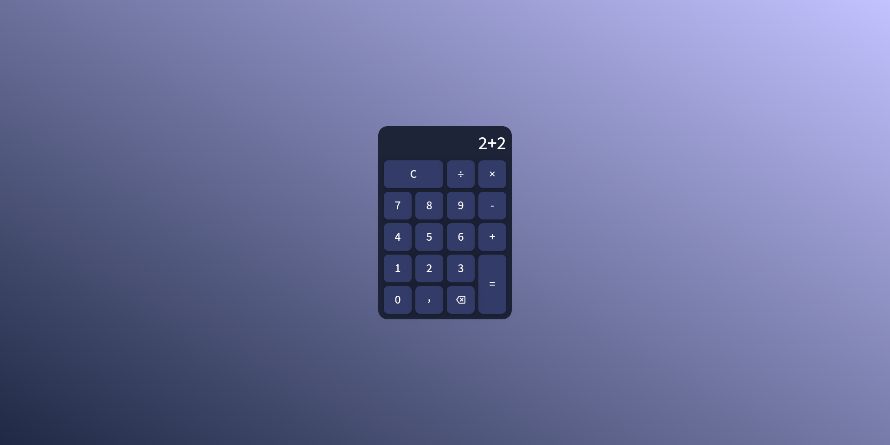

# Calculadora Web

Uma **calculadora web** desenvolvida com **HTML**, **CSS** e **JavaScript**, capaz de realizar operações matemáticas básicas por meio de uma interface simples.

## Índice

- [Sobre o Projeto](#sobre-o-projeto)
- [Pré-visualização](#pré-visualização)
- [Funcionalidades](#funcionalidades)
- [Tecnologias Utilizadas](#tecnologias-utilizadas)
- [Recursos Externos](#recursos-externos)
- [Como Executar](#como-executar)

## Sobre o Projeto

Este projeto foi desenvolvido com o objetivo de praticar **desenvolvimento web** utilizando **HTML**, **CSS** e **JavaScript**. Além da construção da interface, o foco foi implementar toda a lógica da calculadora manualmente, reforçando conceitos de manipulação do **DOM**, **eventos** e **processamento de expressões matemáticas**.

## Pré-visualização



## Funcionalidades

- Interface simples e elegante
- Suporte à digitação pelo teclado
- Exclusão de caracteres
- Operações básicas (+, −, ×, ÷)
- Prevenção de entradas inválidas
- Atualização da posição do cursor
- Cálculo da expressão inteira

## Tecnologias Utilizadas

- **Design:** Figma
- **Front-End:** HTML, CSS, JavaScript
- **Controle de Versão:** Git

## Recursos Externos

- **Google Fonts** - [Mada](https://fonts.google.com/specimen/Mada?query=Mada)
- **Google Fonts Icons (Material Symbols)** - [Backspace](https://fonts.google.com/icons?query=Mada&selected=Material+Symbols+Outlined:backspace:FILL@0;wght@400;GRAD@0;opsz@24&icon.query=backspace&icon.size=24&icon.color=%23e3e3e3])

## Como Executar

### Passo a passo

```bash
# Clone este repositório
git clone https://github.com/lohan-martins/web-calculator.git

# Acesse a pasta do projeto
cd web-calculator

# Abra o arquivo index.html no navegador

```
